# Welcome to Commandline TaskTracker

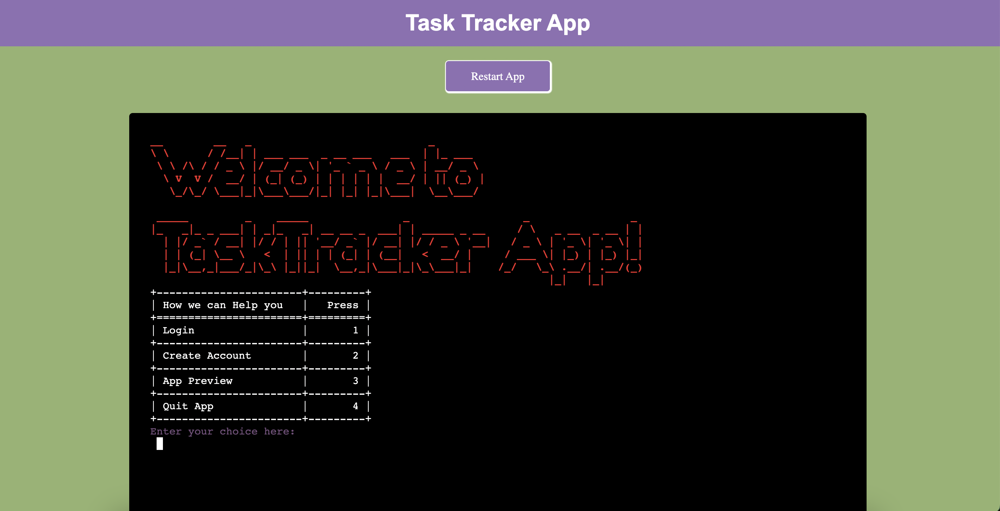

The deployed webapp can be accessed [here](https://task-tracker-pp3-a601e8d655b1.herokuapp.com/).

Task Tracker is a Python command-line application designed to help users effectively manage their tasks. It provides features for creating, updating, and tracking tasks, along with user authentication and data persistence.

## User Experience (UX)

*   ### User stories

    -   As a user, I want to be able to create a new account so that I can access the task management features.
    -   As a user, I want to securely log in to my account using SHA-215 encryption for enhanced security.
    -   As a user, I want to view a preview of all tasks to know how the App works.
    -   As a user, I want to view my tasks for today's date so that I can plan my day effectively.
    -   As a user, I want to see my tasks displayed with priority levels and visually distinguish completed tasks with green color and pending tasks with red color.
    -   As a user, I want to add a new task with a name, details and priority level so that I can keep track of my upcoming tasks.
    -   As a user, I want to be able to update the status of a task (e.g., mark it as completed) so that I can track my progress.
    -   As a user, I want to delete a task that I no longer need so that my task list remains organized.
    -   As a user, I want the input dates to be validated to ensure they are in the correct format (YYYY-MM-DD).
    -   As a user, I want the all inputs  to be validated to ensure they are in the correct format.
    -   As a user, I want to receive feedback on successful or unsuccessful task management operations.
    -   As a user, I want the Task Tracker website to have a user-friendly interface for easy navigation and interaction.
 

*   ### Flow Charts

    -   The Flowchart for my program was created using <b>[app.diagrams.net](https://app.diagrams.net/)</b> and it visually represents how the system works.
    -   The Flowchart may differ slightly from the actual application as certain features were added, modified, or removed during discussions and implementation. 
[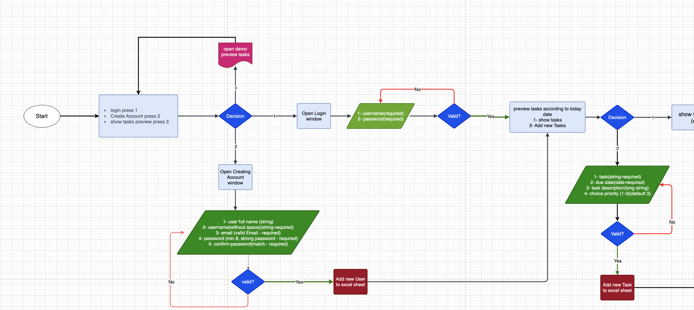](readme/flowchart_2.png)
 

*   ### SURFACE/DESIGN 
    The tracking system displays pages as steps for tracking daily tasks. Every page contains information guiding the user how to interact with the application 
    -   <b>TaskTracker Menu Page:</b>
        When the user first launches the program a welcome message is displayed with options table. 
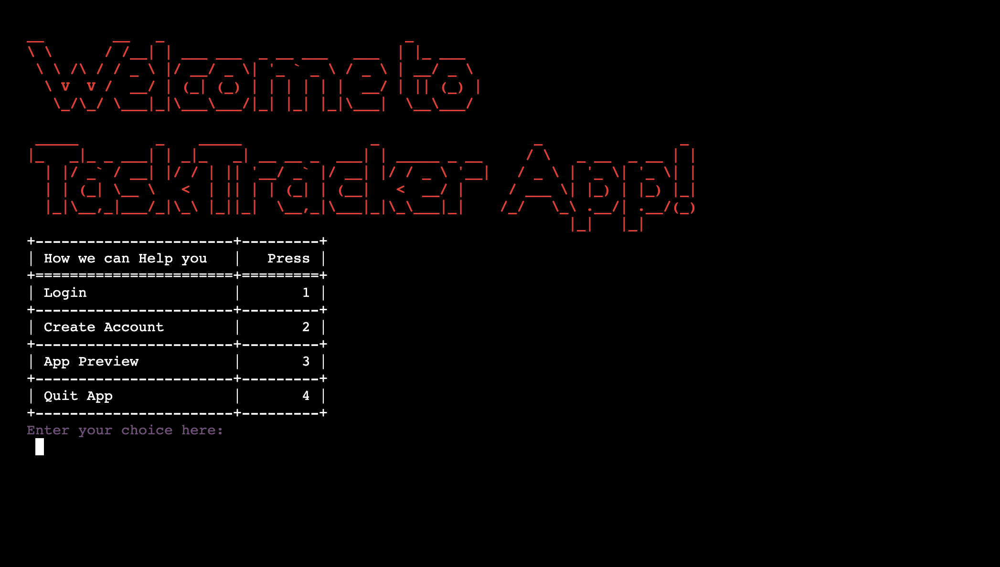 

    -   <b>TaskTracker Tasks Page</b>
          When the user login and see his daily tasks. 
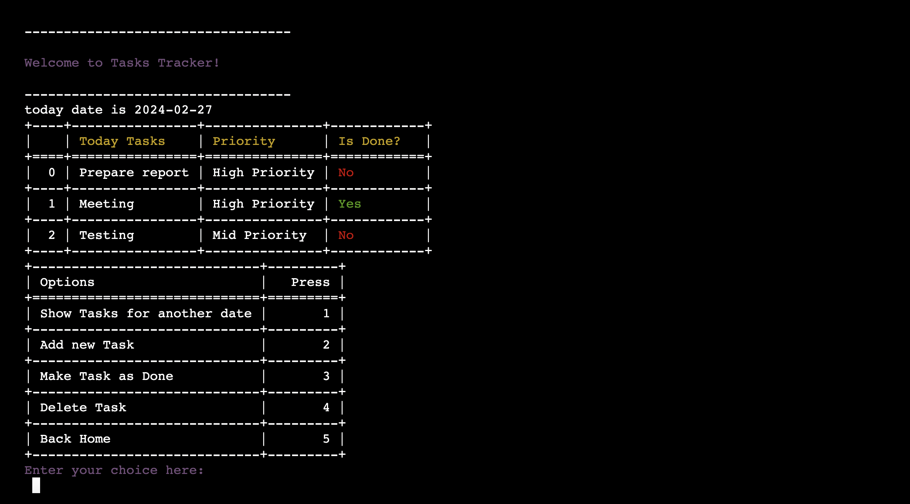 

    -   <b>TaskTracker overview Tasks Page</b>
    When the user wants to get an overall preview of the tasks table. 
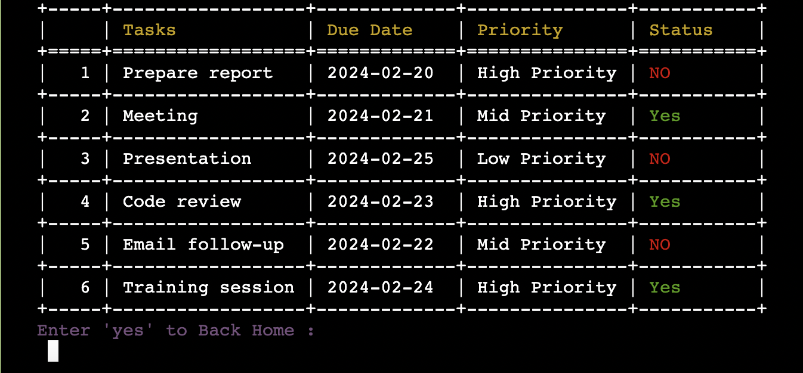 

## Features
*   ### TaskTracker overview Tasks Page
    -   <b>User Authentication:</b> Users can securely create accounts and log in using SHA-215 encryption.
      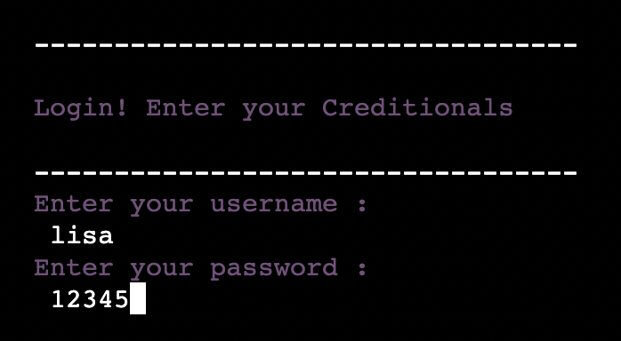 
      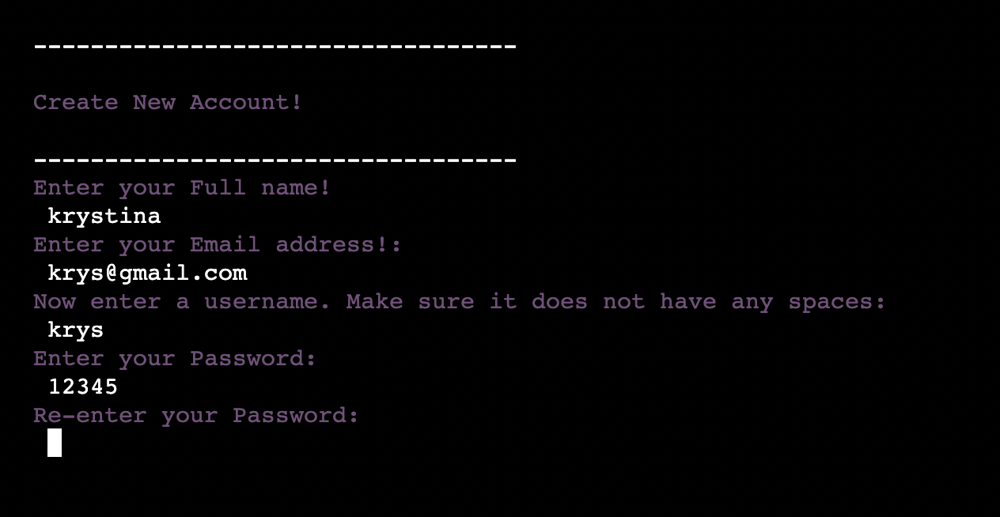 

    -   <b>Task Management:</b> Users can create, update, and delete tasks, as well as view tasks by specific dates.
       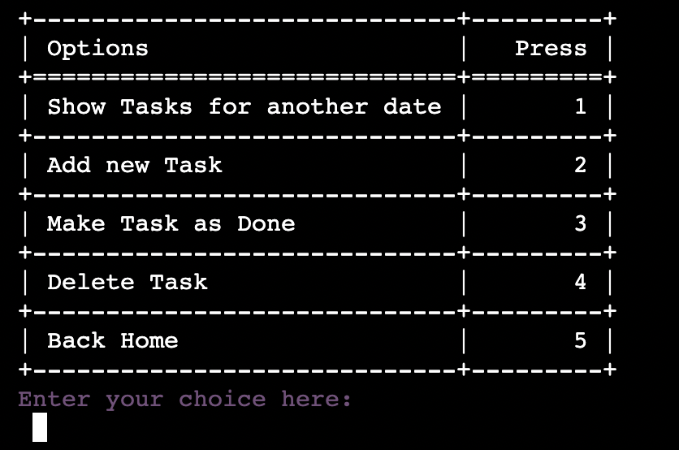 

    -   <b>Priority and Status Tracking:<b> Tasks are assigned priority levels and marked as completed or pending. Completed tasks are visually distinguished with green color, while pending tasks are highlighted in red.
      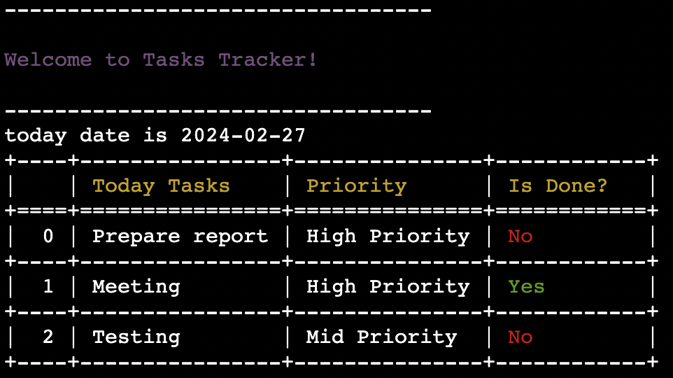 

    -   <b>Date Validation:</b>
        Input dates are validated to ensure they are in the correct format (YYYY-MM-DD).
         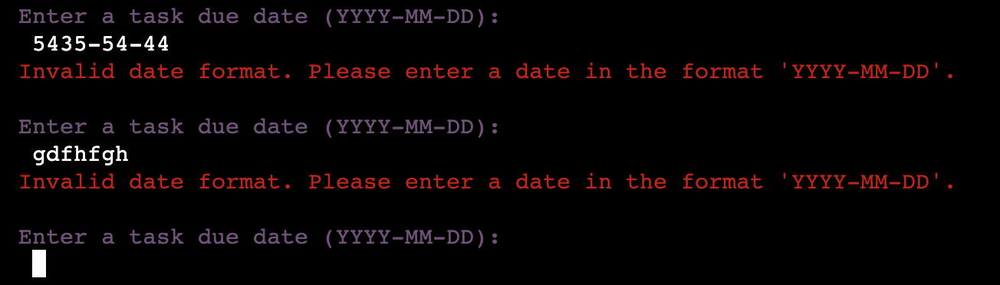 
    -   <b>Data Validation:</b>
        All Inputs data are validated to ensure they are in the correct format.
         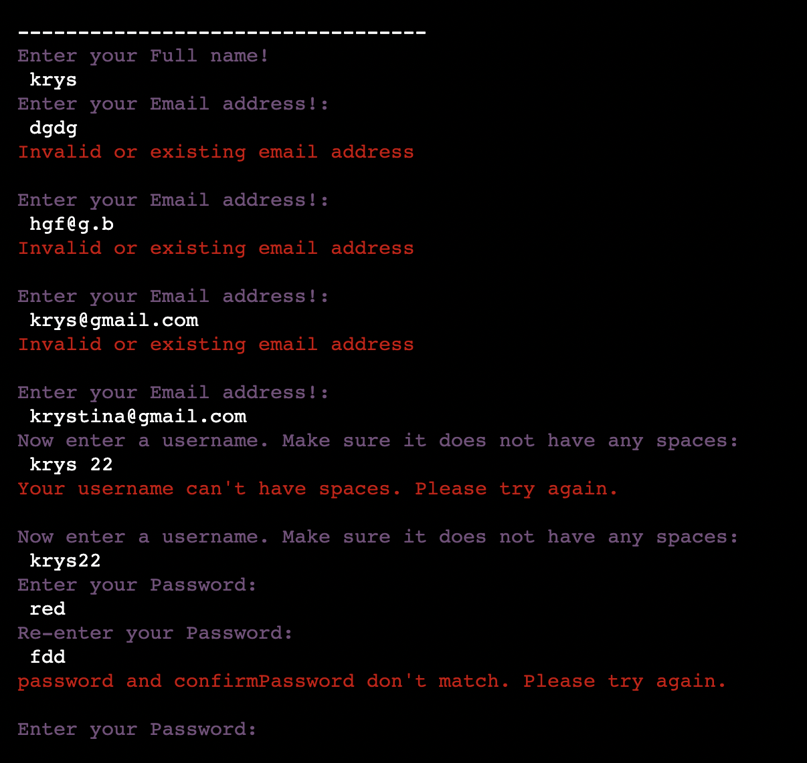
         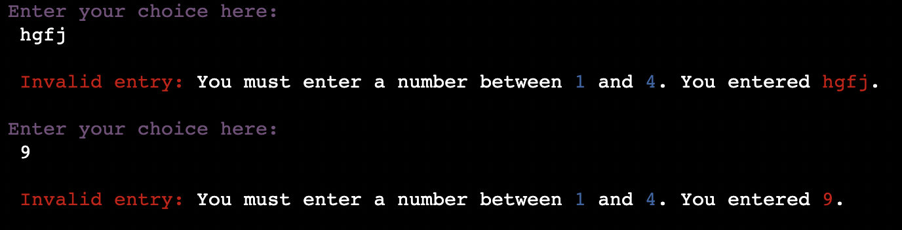 

    -   <b>User-Friendly Interface:</b> The application features a simple command-line interface for easy interaction.

