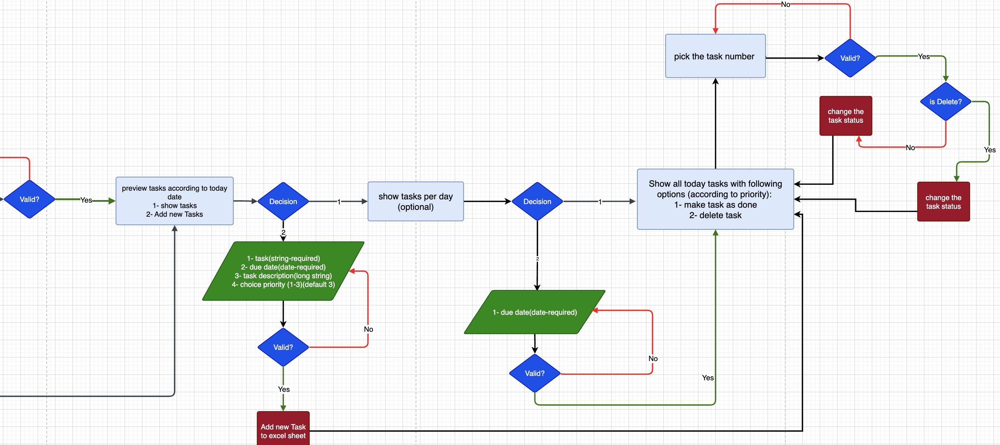

# Welcome to Commandline TaskTracker

The deployed webapp can be accessed [here](https://task-tracker-pp3-a601e8d655b1.herokuapp.com/).

Task Tracker is a Python command-line application designed to help users effectively manage their tasks. It provides features for creating, updating, and tracking tasks, along with user authentication and data persistence.

## User Experience (UX)

*   ### Project Goals
    -   <b>Efficient Task Management:</b> The primary goal of TaskTracker is to provide users with a reliable and user-friendly platform for managing tasks effectively. This includes features such as creating, updating, and deleting tasks, as well as setting priorities and due dates.

    -   <b>Improved Productivity:</b> TaskTracker aims to help users boost their productivity by offering tools and functionalities to organize and prioritize tasks efficiently. By providing clear visibility into task statuses and deadlines, users can stay focused and accomplish more in less time.

    -   <b>User-Friendly Interface:</b> One of the key goals of TaskTracker is to provide an intuitive and easy-to-use interface that minimizes the learning curve for new users. 

    -   <b>Reliability and Stability:</b> TaskTracker aims to be a dependable and stable tool that users can rely on for their task management needs.

*   ### Target Audience
    -   <b>Individual Users:</b> This could encompass anyone looking to manage their tasks and productivity effectively, such as students, professionals, freelancers, or homemakers.

    -   <b>Students:</b> TaskTracker can assist students in organizing their academic assignments, projects, and deadlines.

    -   <b>Productivity Enthusiasts:</b> Individuals interested in personal productivity and time management techniques may find TaskTracker valuable for implementing task prioritization, and goal setting strategies.

*   ### User stories

    -   As a user, I want to be able to create a new account so that I can access the task management features.
    -   As a user, I want to securely log in to my account using SHA-215 encryption for enhanced security.
    -   As a user, I want to view a preview of all tasks to know how the App works.
    -   As a user, I want to view my tasks for today's date so that I can plan my day effectively.
    -   As a user, I want to see my tasks displayed with priority levels and visually distinguish completed tasks with green color and pending tasks with red color.
    -   As a user, I want to add a new task with a name, details and priority level so that I can keep track of my upcoming tasks.
    -   As a user, I want to be able to update the status of a task (e.g., mark it as completed) so that I can track my progress.
    -   As a user, I want to delete a task that I no longer need so that my task list remains organized.
    -   As a user, I want the input dates to be validated to ensure they are in the correct format (YYYY-MM-DD).
    -   As a user, I want the all inputs  to be validated to ensure they are in the correct format.
    -   As a user, I want to receive feedback on successful or unsuccessful task management operations.
    -   As a user, I want the Task Tracker website to have a user-friendly interface for easy navigation and interaction.
 

*   ### Flow Charts

    -   The Flowchart for my program was created using <b>[app.diagrams.net](https://app.diagrams.net/)</b> and it visually represents how the system works.
    -   The Flowchart may differ slightly from the actual application as certain features were added, modified, or removed during discussions and implementation. 
    
      

        
 

*   ### Design
    The tracking system displays pages as steps for tracking daily tasks. Every page contains information guiding the user how to interact with the application 
    -   <b>TaskTracker Menu Page:</b>
        When the user first launches the program a welcome message is displayed with options table. 
 

    -   <b>TaskTracker Tasks Page</b>
          When the user login and see his daily tasks. 
 

    -   <b>TaskTracker overview Tasks Page</b>
    When the user wants to get an overall preview of the tasks table. 
 

## Features
*   ### Exiting Features
    -   <b>User Authentication:</b> Users can securely create accounts and log in using SHA-215 encryption.
       
       

    -   <b>Task Management:</b> Users can create, update, and delete tasks, as well as view tasks by specific dates.
        

    -   <b>Priority and Status Tracking:</b> Tasks are assigned priority levels and marked as completed or pending. Completed tasks are visually distinguished with green color, while pending tasks are highlighted in red.
       

    -   <b>Date Validation:</b>
        Input dates are validated to ensure they are in the correct format (YYYY-MM-DD).
          
    -   <b>Data Validation:</b>
        All Inputs data are validated to ensure they are in the correct format.
         
          

    -   <b>User-Friendly Interface:</b> The application features a simple command-line interface for easy interaction.
 
*   ### FUTURE FEATURES 
    -   <b>Task Categories:</b> Allow users to categorize tasks into different categories or projects for better organization.
    -   <b>Overdue Task :</b> Provide visual table for overdue tasks.
    -   <b>Category Management:</b> Enable users to create, edit, and delete categories to organize tasks more efficiently.
    -   <b>Task Reminders:</b> Implement notifications or reminders for upcoming tasks to help users stay organized and on track.

*   ### Remaining Bugs 
    -   <b>Task Duplication Issue:</b> Updating or deleting tasks may affect just the first task if they share the same name. This occurs when tasks are not uniquely identified, leading to unintended changes in task status or deletion. A fix is needed to ensure that tasks are properly identified and modified individually.

    -   <b>Updating Completed Tasks:</b> Currently, the application allows updating tasks even if they have already been marked as completed. This behavior may lead to inconsistencies in task management and data integrity. Implementing validation to prevent updating completed tasks is necessary to maintain the accuracy of task statuses. 

## Project Structure
The TaskTracker project follows a structured organization to maintain clarity and scalability. Below is an overview of the main directories and files within the project:

*   ### Main Scope
    -   <b>run.py:</b> This is the main entry point of the application. It initializes the program and orchestrates the interaction between different modules and components.

*   ### services Folder
    -   <b>tasks.py:</b> This module contains functions and methods related to task management, including adding, updating, deleting, and retrieving tasks from the database.

    -   <b>user.py:</b> The user.py module handles user authentication, registration, and login functionalities.

*   ### utils Folder
    -   <b>helpers.py:</b> This file contains utility functions and helper methods used across various parts of the application, such as printing formatted messages and validating user input.

    -   <b>table.py:</b> The table.py module is responsible for generating formatted tables for displaying data in a structured manner, enhancing the user interface.

    -   <b>conn.py:</b> This module manages the connection to external services, such as the Google Spreadsheet API, for data storage and retrieval.

## Libraries 
- <b>google-auth:</b> This library is essential for handling authentication with Google services, such as accessing Google Sheets. It provides secure authentication mechanisms and handles the authentication flow required to access Google APIs securely.

- <b>gspread:</b> gspread is a Python API for Google Sheets. It allows your Python code to interact with Google Sheets programmatically, enabling tasks such as reading data from and writing data to Google Sheets. This library is crucial for integrating your application with Google Sheets and performing operations on spreadsheet data.

- <b>pyfiglet:</b> pyfiglet is a library for creating ASCII art text banners. It provides a simple way to generate stylized text output, which can be useful for displaying headers, titles, or decorative elements in your application's console output. While not strictly necessary for functionality, it can enhance the visual presentation of your application.

- <b>tabulate:</b> tabulate is a library for formatting tabular data in a visually appealing way. It simplifies the task of presenting data in a tabular format, making it easier to read and understand. This library is particularly useful for displaying structured data, such as task lists or analytics results, in a clear and organized manner within your application's output.

## Validator Testing
- PEP8:
    - No errors were returned from http://pep8online.com
    - also used a black formatter package which helps formating the python code https://pypi.org/project/black/

## Deployment
This project is deployed using Code Institute's mock terminal for Heroku.

Steps for Deployment:
1. Fork or Clone [this Repository](https://github.com/raneem-yad/project-portfolio-3.git)
2. Set up Google Sheets and Google Drive APIs in Google Cloude
3. Download the Key json file from Google, upload it to the project. Change the name to creds.json
4. Create a new Google Sheet named <b>'TaskTrack'</b>
5. Add label one worksheet <b>'users'</b> and another one <b>'tasks'</b>
6. Create new Heroku app
7. Set the buildpacks to python and node.js (in that order)
8. Add Config Variables 'CREDS' and 'PORT'
9. Link the Heroku app to the repository
10. Click Deploy

## Credits
-   The code for clearing the terminal was adapted from a solution found on [stackoverflow](https://stackoverflow.com/questions/2084508/clear-terminal-in-python)
-   The styling and text effects were inspired by and adapted from the [commandline-budgetapp
](https://github.com/adamsburge/commandline-budgetapp)
-   The code for linking to and manipulating the Google Spreadsheet was  ispired and adapted from the Code Institute Love Sandwiches tutorial.
  
## Acknowledgements

-   My Mentor for continuous helpful feedback.
-   My husband for supporting me the whole time.

